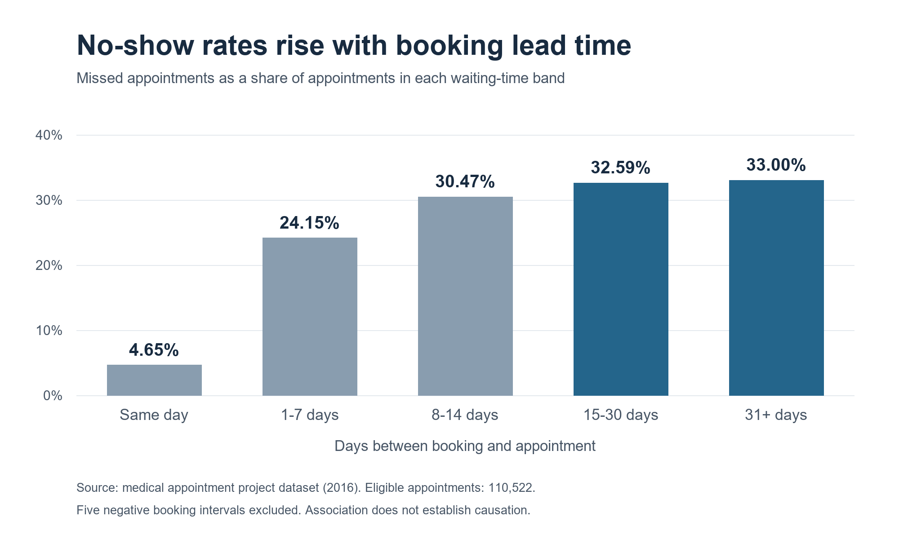

# Medical Appointment No-Show Analysis

An independent data analyst portfolio project using Google Sheets
and SQL in Google BigQuery.

## Business question

How do appointment no-show rates vary by booking lead time,
age, recorded gender, and SMS reminder status?

The goal was to identify patterns that could inform a clinic’s
efforts to reduce missed appointments.

## Dataset

- 110,527 appointment records from 2016.
- Each row represents one appointment, not one unique patient.
- No-show = Yes means the appointment was missed.
- Original dataset attribution is being confirmed.
  Row-level data is not included in this repository.

## Tools and methods

- Google Sheets: formulas, summary tables, and charts.
- BigQuery SQL: data quality checks and grouped comparisons.
- Google Docs: business findings and recommendations.

SQL techniques include COUNT, COUNTIF, COUNT DISTINCT, CASE,
common table expressions, DATE_DIFF, GROUP BY, and ORDER BY.

## Data quality

- Found no duplicate appointment IDs.
- Excluded one negative age from age comparisons.
- Excluded five negative booking intervals from waiting-time comparisons.
- Retained seven ages over 100 because they were not confirmed errors.
- Preserved repeated patient IDs because patients can have multiple appointments.

## Key findings

- Overall, 22,319 appointments were missed: a 20.19% no-show rate.
- Same-day appointments had a 4.65% no-show rate, compared with
  33.00% for appointments booked 31 or more days ahead.
- The 18–34 age group had the highest no-show rate at 23.98%;
  the 65+ group had the lowest at 15.50%.
- Recorded SMS recipients had a higher overall no-show rate,
  but a lower rate within every positive waiting-time band.
  This illustrates why group composition matters.
- Recorded gender categories had similar rates:
  20.31% for F and 19.97% for M.

## Business recommendation

Test an additional confirmation reminder with an easy cancellation
or rescheduling option for appointments booked more than 14 days ahead.

Compare the pilot against the existing process using no-show rates,
advance cancellations, refilled slots, and costs.
Validate these historical patterns using current clinic data first.

This recommendation is part of a simulated business scenario.
No pilot was conducted.

## Limitations

These findings show associations, not causes.
SMS status does not establish that patients read their messages.
The historical dataset may not represent current clinic performance.

## Project files

- [SQL analysis](medical_appointment_analysis.sql):
  nine commented queries used to investigate the data.
- [Booking lead-time chart](no_show_by_booking_lead_time.png):
  visual summary of the main finding.

## What I learned

I practiced checking data quality, calculating group-specific rates,
and translating analysis into a business recommendation.

The SMS analysis demonstrated why an overall comparison can be
misleading when groups differ in booking lead time.
Analysis of 110,527 medical appointments using Google Sheets and SQL in BigQuery to explore factors associated with missed appointments.
